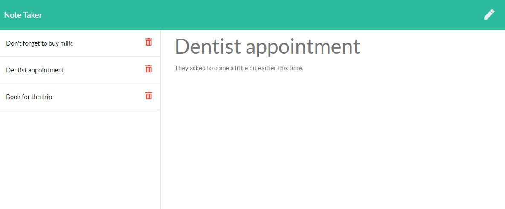

# Note Taker

The application allows user to enter, save and delete notes. It saves and retrieves note data from JSON file.

# Technologies used

* Express.js
* JSON
* Insomnia
* Javascript
* Git, Ginhub, Heroku
* Server-side APIs

# Deployed web site

The link to deployed site is https://notetaker-ek.herokuapp.com/.

# GitHub repository

You can find the repository here: https://github.com/evkonradi/NoteTaker.

# Page preview

This is the preview of the initial page:
